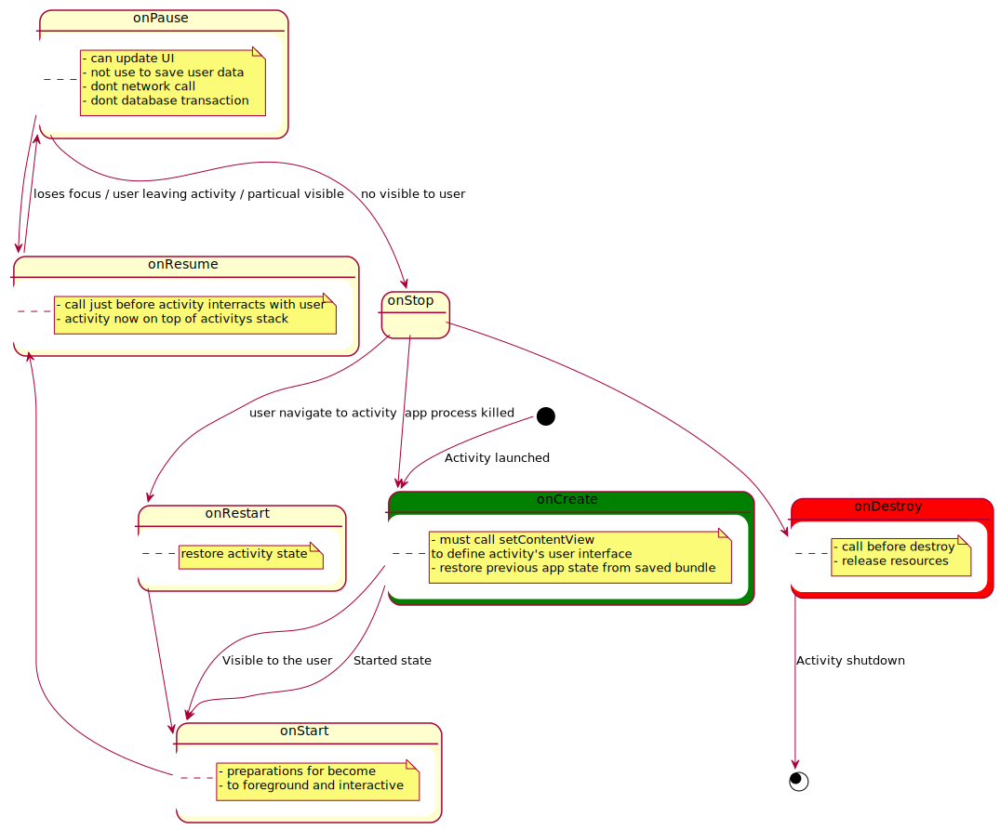

# The Activity Lifecycle 
- What
    - As a user navigates through, out of, and back to your app, the Activity instances in your app transition through different states in their lifecycle.

- Why
    - We need to know that a state has changed to declare how your activity behaves when the user leaves and re-enters the activity.
- How
    - Use lifecycle callbacks
    - Use a lifecycle aware component for reusable component

 [Plantuml Activity Life cycle](https://www.plantuml.com/plantuml/umla/TLHDQnj13BtFhn3aK2YOtdqeAUcbjzBGN4eFyeviJpEMbf769fJ-zqPCj74MSZ9--dZlIPgzLSDc_LHJ-lNnDsmsdq7uhX4QRU7BPELSx0agTfwEb5DIGwCb1MuEZOZXRs8nWbOEHmFPB_446pXrDPYmLb2oEs4ZjeT25qXW0fdsXGdmXUc3GbTgKDYexN7o3j18JHh1tEXSf2lWFCCGiczo0iKpPTXrpfKISGONa_wbHULcsBftgx05_pNAeyMxMGz5owwIYxGZWSiA-v6qiXsuQvuRpTZGYh32NXhiQ98JUSZ40JeqwPm1EG-tw2Duepy5puko7wJzH24Y_eUAIliX8l9WCyR-nnUm8-TSvZmedLFXKkmuxC7cDO7b0i9WCdlJWDM7DZs-KPc2CNH-nwwqXIfAxdtg2f_6MYlXkV1XQVUCpzYiJ1qhdCV0mz_eixONy737qEVioJ-_ES1YpkCJzfiOd1aDFPY53PZi8kqHV30Bw1axzBg6hAvD-DfXA5cjOGNVcynRO0aVhc8SpOXTbVjIjqCTuxaSq3nxcSgw8fwZd_tSP29LU2orKhu-XNSkCkYMLnGiuBMnmAY_VWDh6Lz9hSbJx6S1uAPHNXClqJZ3kC3y2ZUgX4gkJ7gRIDyUVtGO_CzVfwiFaXwxPRbmkYNE_LJ_0m00)
## Restrictions on starting activities from the background
- What
    - Android 10 (API level 29) and higher place restrictions on when apps can start activities when the app is running in the background. These restrictions help minimize interruptions for the user and keep the user more in control of what's shown on their screen.

- How
    - Display notifications instead
    - [Exceptions to the restriction](https://developer.android.com/guide/components/activities/background-starts)

## Activity state and ejection from memory
- What
    - The system kills processes when it needs to free up RAM
- How https://developer.android.com/guide/components/activities/activity-lifecycle#asem

## [Handling Lifecycles with Lifecycle-Aware Components](./lifecycle-aware-components.md)