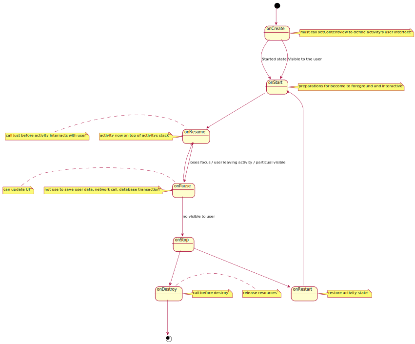

# Activity

- What
    - Activity serves as the entry point for an app's interaction with user.
    - An app can have multi activity
- How
    - An activity provides the window in which the app draws its UI
- Setup
    1. Create a subclass of Activity
    2. Define that activity to Manifest file
    3. Add intent-filter if you want this is first activity when open app
    4. Add intent-filter if you want other app can start this activity
    5. Add activity permission if you require other app request permission to start this activity

    
    [Plantuml Activity Life cycle](https://www.plantuml.com/plantuml/umla/VLF1Yjmm3BtxAnxieL08lS-XB6mllPKktKlfmPCeC-vcfC5ICYob_rvhdNgQWUufHEzPx-bPlbUBsURJ5Bw__u6k-mZXXqpH247DF-t_xf296B_2xy1YX9mEHuECZH5mcjNGnsc2aZq86x4z9ReWm0G3ZOa9iRUq97jvfvYLCbAXvJ7s58W7UEiGccXNBJswI-pm-gK1Ret-otfAclOJkQOT2QuIRZrNSa27SwPppD6Ii6AKZ3trSYA7JBn0Xomp3uWyLBEl4spjLkdLnrVI-KIhv4IZArxBw6f4FpsiFRb0owJsTm759TcnUaTt9R1S80oJSsdQokg9zCyRIrNkhwSliRJQOH8bdxAV5Hzg_XF59V6XzIhraeUbVeuJbXfbM1kyFM7br04Pytc81VtssGk5w6gUgCQ5gdB1euE3i879BfAVuTcqeZFsqS_boEeEXJT3RbmzbbHs1SBI5c2z_8hzuzwlwtOd6h139hNDlTI52usoMRdGdigdWcPvmLscmL_ALhdXjyeDQCknxiLmBMUQA2gvDPbpJxh9OJrVTSfJ3k6-mELT_m40)