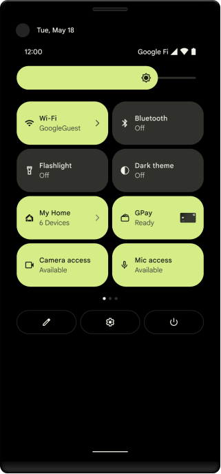

# Permissions on Android

- Why
    - App permission restrict access to data and perform actions

- Type

| Permission type | Protection level| Accessing data and performing actions scope |Workflow | Example|
| ----------- | ----------- | ----------- | ----------- | ----------- | 
| install-time | - normal <br> - signature | Limited and minimally affect the system or other apps.| Automatically granted when app installed | Internet access|
| runtime | dangerous | Additional and more substantially affect the system and other apps. | Android >= 6.0 Request runtime permission| Storage, Phone call|
| special | appop | Special permissions correspond to particular app operations. | Only the platform and OEMs can define special permissions. The Special app access page in system settings contains a set of user-toggleable operations.| drawing over other apps|

## Permission workflow overview


## Best practice
- Consider whether another installed app might be able to perform the functionality on your app's behalf -> You do not need to request a permission to do that action.
    - Example: Take a photo
- Request run-time permission only at the time when user uses an app feature that require that permission
- Each time your app needs to access functionality that requires a permission, you should check that your app is still granted that permission.
- Know the libraries permissions you're working with

## Permission workflow runtime


## Attention
- One-time permissions whenever your app requests a permission related to location, microphone, or camera
- Android auto-resets permissions of unused apps - Android 11 (API level 30) or higher
- Request to become the default handler if necessary - If you want to request the permissions specific to call logs and SMS messages
- Grant all runtime permissions for testing purposes
    - adb shell install -g PATH_TO_APK_FILE
- List permissions and status by group:

```$ adb shell pm list permissions -d -g```
- Grant or revoke one or more permissions:
```$ adb shell pm [grant|revoke] <permission-name>```

- Identify the screen location of camera and microphone are using indicators

- On supported devices that run Android 12 or higher, users can enable and disable camera and microphone access for all apps on the device by pressing a single toggle option. 

## Restrict interactions with other apps by set your app components permission