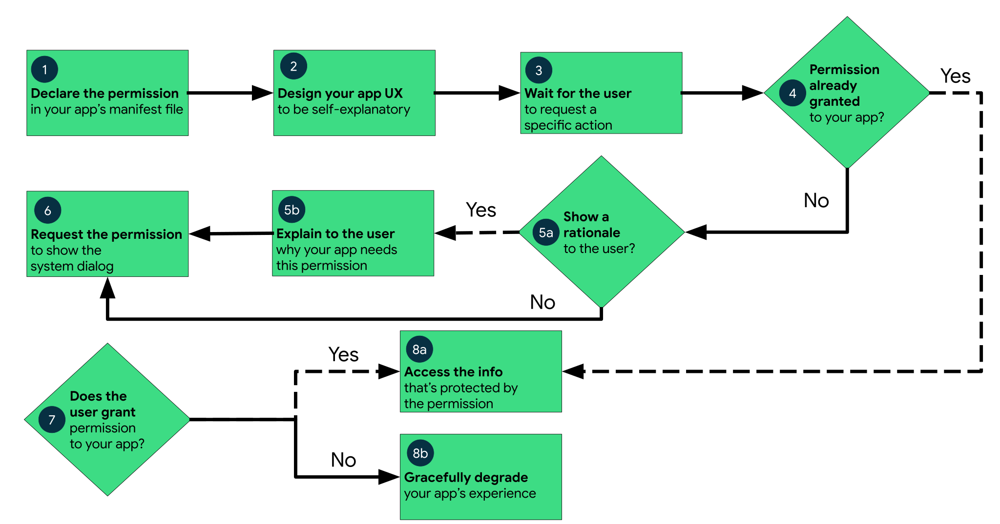

# Permissions on Android

- Why
    - App permission restrict access to data and perform actions

- Type

| Permission type | Protection level| Accessing data and performing actions scope |Workflow | Example|
| ----------- | ----------- | ----------- | ----------- | ----------- | 
| install-time | - normal   - signature | Limited and minimally affect the system or other apps.| Automatically granted when app installed | Internet access|
| runtime | dangerous | Additional and more substantially affect the system and other apps. | Android >= 6.0 Request runtime permission| Storage, Phone call|
| special | appop | Special permissions correspond to particular app operations. | Only the platform and OEMs can define special permissions. The Special app access page in system settings contains a set of user-toggleable operations.| drawing over other apps|

## Permission workflow overview

## Best practice
- Consider whether another installed app might be able to perform the functionality on your app's behalf -> You do not need to request a permission to do that action.
    - Example: Take a photo
- Request run-time permission only at the time when user uses an app feature that require that permission

## Permission workflow runtime

