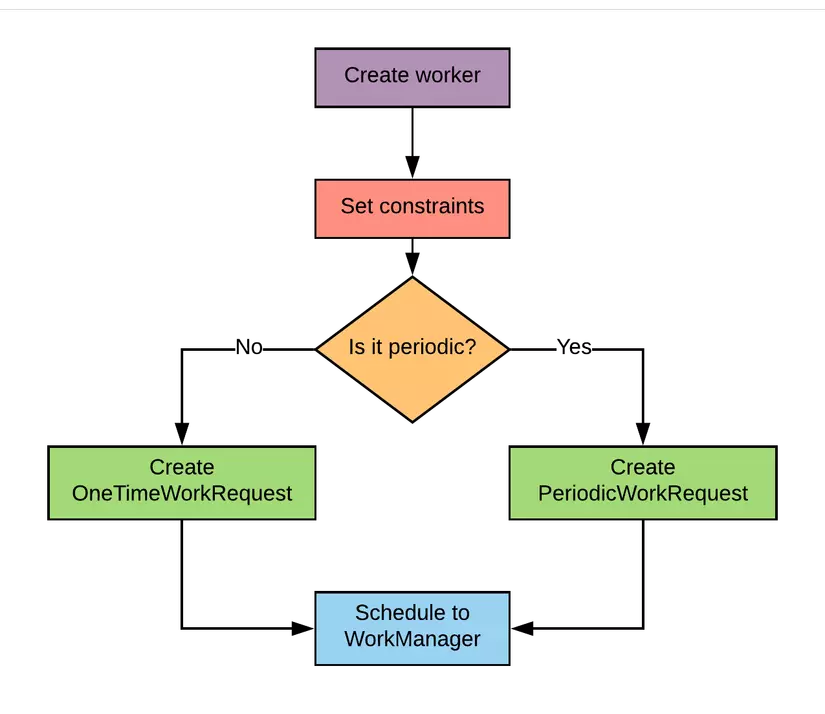
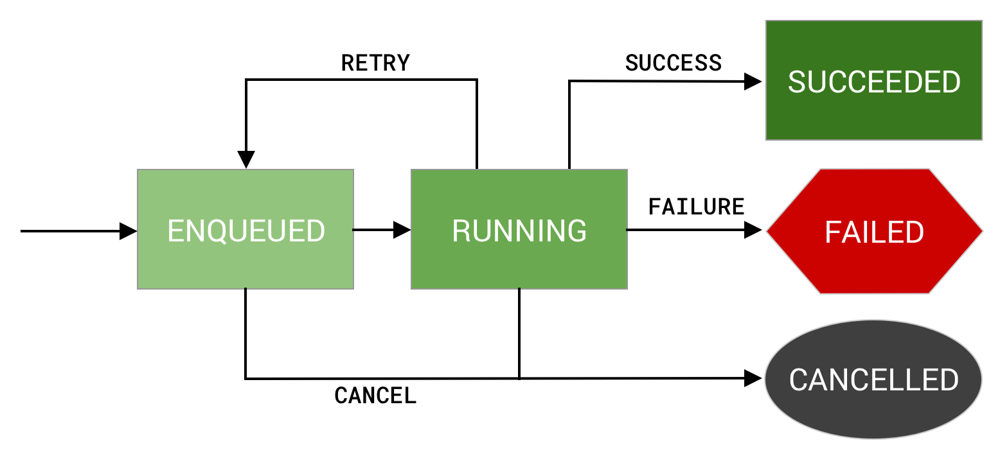
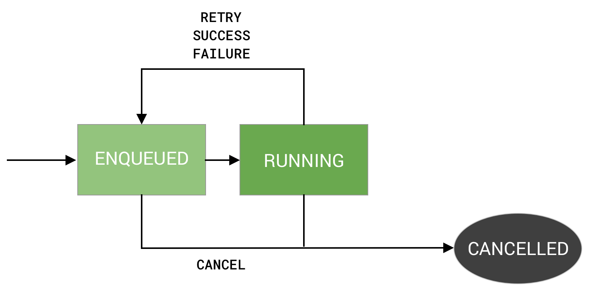
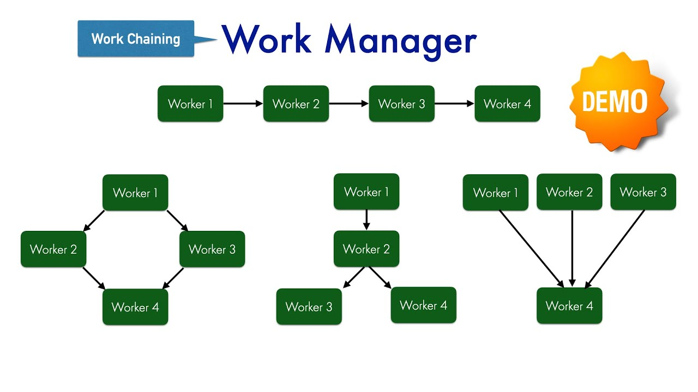

# Work manager

## What
- WorkManager is the recommended solution for persistent work.
- Work is persistent when it remains scheduled through app restarts and system reboots.

## How

| Type | Periodicity | How to access |
| -----|-------------|---------------|
| Immediate| One time | OneTimeWorkRequest and Worker.| 
|Long Running| One time or periodic| Any WorkRequest or Worker. Call setForeground() in the Worker to handle the notification.|
|Deferrable| One time or periodic| PeriodicWorkRequest and Worker.|

### One-time work flow

### Periodic work flow

## Feature

| Name| What| Example|
|-|-|-|
|Work constraints| Set conditions to run works| the device is idle|
|Robust scheduling| Schedule work to run one time or repeatedly| |
|Expedited work| To run important tasks immediately|
|Flexible retry policy| Retry fail works||
|Work chaining| Control which works to run sequentially and which run in parallel| |
|Built-In threading interoperability| WorkManager integrates seamlessly with Coroutines and RxJava and provides the flexibility to plug in your own asynchronous APIs.| |
|Use WorkManager for reliable work| WorkManager is intended for work that is required to run reliably| Make sure to complete work even the app exits, or the device restarts|

### Chaining works

## Relationship to other APIs
|API| Recommended for| Relationship to work manager|
|-|-|-|
|Coroutines| Asynchronous works that does not need to be persistent| Coroutines are the standard means of leaving the main thread in Kotlin. Coroutine leave memory once the app closes. Work Manager for persistent work.|
| AlarmManager| Alarms only| AlarmManager wakes a device from Doze mode. Only use it for precise alarms or notifications such as calendar events — not background work.|

## Replacing deprecated APIs
The WorkManager API is the recommended replacement for all previous Android background scheduling APIs, including:
- FirebaseJobDispatcher
- GcmNetworkManager
- Job Scheduler.