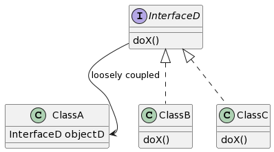
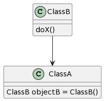
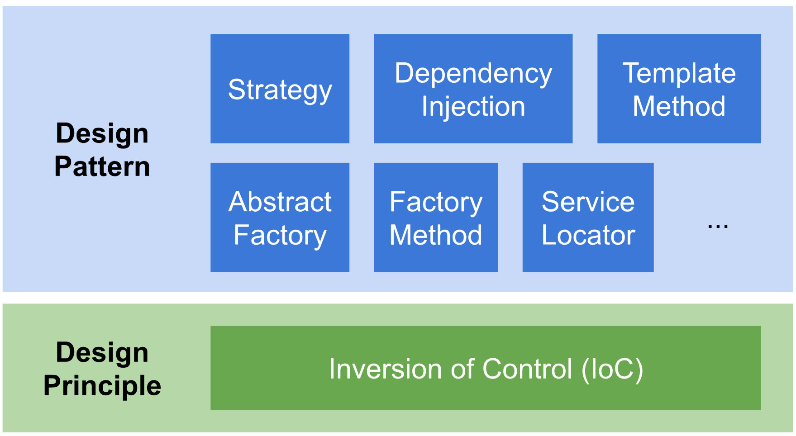

# Inversion of controls (IoC)

## What
- Inversion of Control (IoC) is a principle that inverts the flow of control to achieve loosely coupled classes that make them testable, maintainable and extensible.

[Inversion of controls (IoC)](https://www.plantuml.com/plantuml/uml/SyfFKj2rKt3CoKnELR1Io4ZDoSa70000)

[No Inversion of controls](https://www.plantuml.com/plantuml/umla/SoWkIImgAStDuKhEIImkLd06aOuArLmA4AQJGdvILcfoYPE2BLH0GvEhbWjPjLCrLqf-14GOgaTNrmvg4XUNGsfU2j1y0000)

## Why

- To decouple the execution of a task from implementation.
- To focus a module on the task it is designed for.
- To free modules from assumptions about how other systems do what they do and instead rely on contracts.
- To prevent side effects when replacing a module.

## How

https://medium.com/@aaron.chu/whats-inversion-of-control-ioc-fb09e2ad7b63