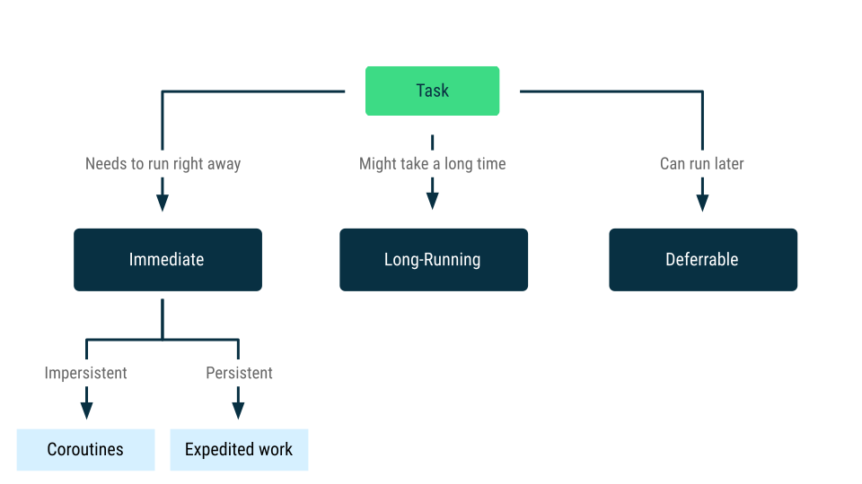
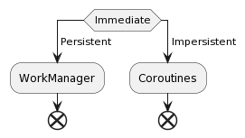
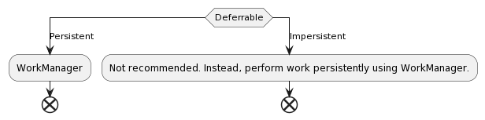
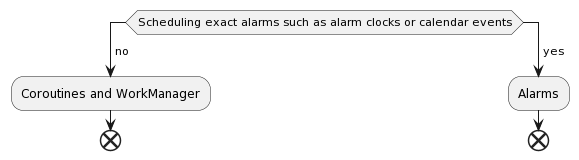
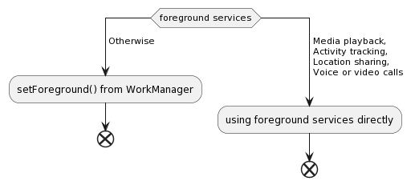

# Background task

## Why
- Doing work on the main thread can lead to poor performance and therefore a poor user experience.

## When
- In general, you should take any blocking tasks off the UI thread. Common long-running tasks include things like decoding a bitmap, accessing storage, working on a machine learning (ML) model, or performing network requests.

## [An app is running in the background vs An app is running in the foreground](https://www.plantuml.com/plantuml/uml/hP0nRiCm34NdwXH_Ixpq0EsINg1TUW55PcAY3cMGb8tSleG3TUkMHH10lV-V-99EvbcztUQKR6Cl4uuVopAaaermn6SLGht09q9UbeCX5-ULdIckIYXDbSJdErOsFiy4h_lhPgIlGmBU8Wziq2R2SWNBFZ_dydFLscHyJoHZB_n-50KW1_zZijnngKeF04QwSY6BeEpOVq0ZjeddWAKh1gBrrjMnPNkIurVCT6EZ0V-pNRUpwHHdxFaN)

## Common types of background work

## Approaches to background work

[Long running](https://www.plantuml.com/plantuml/uml/JSsn2W8n3CRnlK-HyGxa7a2NMmzKt9nB6sknIIL9ENnx2mftIwPVll-iviKQ5QThjl0SpfKJI6FEd4ONl28CDnJDQiWskkEzoklYsIUKaqEEVxFGUw-krK0mLA9EC4wmi1hwU83E7bK8rhu3sq_vGDFUXDt-z0lC_JGgNm00)

[Deferrable](https://www.plantuml.com/plantuml/uml/JSwzhi8m38RXFLVXiPMEUW67fGDB1n0Riqc-beZy8DjLnTqJ2IIwU7hysgCQYwqvETsY-Njtn0mHlYNqphE2kWj4engAzUx_MkLnui8BvE1GmjTC-RbNvseay3NdHX06ceeQEFnHOtELJ5lhq6ydlMZLM1RQzOVFWR6DzjyR)
<!-- |Category	|Persistent	|Impersistent|
|----------------|---------|------------|
|Immediate|	WorkManager	|Coroutines|
Long running	|WorkManager	|Not recommended. Instead, perform work persistently using WorkManager.
Deferrable	|WorkManager|	Not recommended. Instead, perform work persistently using WorkManager. -->

## [Alarms](https://www.plantuml.com/plantuml/uml/SyfFKj2rKt3CoKnELR1Io4ZDoSa70000)

- Alarms are a special use case that are not a part of background work. 
- AlarmManager wakes the device from Doze mode and its use can therefore have a negative impact on battery life and overall system health.

## Replacing foreground services

Android 12 restricts launching foreground services from the background. For most cases, you should use setForeground() from WorkManager rather than handle foreground services yourself. This allows WorkManager to manage the lifecycle of the foregound service, ensuring efficiency.

You still should use foreground services to perform tasks that are long running and need to notify the user that they are ongoing. If you use foreground services directly, ensure you shut down the service correctly to preserve resource efficiency.

Some use cases for using foreground services directly are as follows:

- Media playback
- Activity tracking
- Location sharing
- Voice or video calls

# [Background Thread](./016_background_tasks/background_threads.md)

# Compare between background task strategies

|Kind|What| When to use| Example|
|-|-|-|-|
|Background threads| Manual handle background thread | manually create thread and understand the basics of threading and its underlying mechanisms|request API|
|Alarm manager|This class provides access to the system alarm services |perform time-based operations outside the lifetime of your application in exact on inexact time|a calendar notification|
|Foreground Services| Foreground services perform operations that are noticeable to the user. |needs to perform a task that is noticeable by the user even when they're not directly interacting with the app.|A music player app that plays music in a foreground service.|
|Work manager| API for background persistent work processing|Work is persistent when it remains scheduled through app restarts and system reboots.| Send a message|
|Broadcast|Android apps can send or receive broadcast messages from the Android system and other Android apps| Receive broad cast from system or other app event| Receive network available event|
|coroutines| A coroutine is an instance of suspendable computation.| to run works concurrently | request API|
|Work manager + Foreground Services| support for long running workers| These Workers can run longer than 10 minutes|a long-running worker that requires access to location, camera, or microphone|