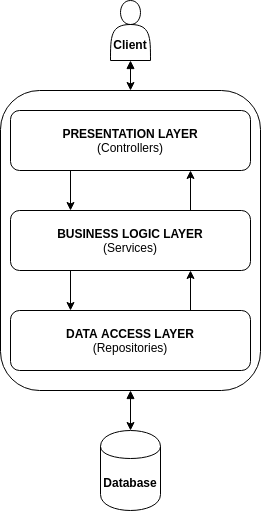
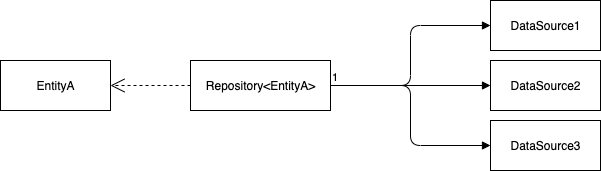

# 3-tier Architectures
    N-Tier architecture is designed for separation of concern
   [N-Tier architecture](https://chathuranga94.medium.com/generic-repository-pattern-for-asp-net-core-9e3e230e20cb)
## Repository pattern / Data access layer

- What:
    - DAL (Data Access Layer) refers to a layer where the information processed by the application is stored and managed.
    - The Repository is a specific pattern that belongs to the DAL.

- Why: 
    - DAL purpose is to keep data access concerns separate from the rest of your application concerns. 
    - Repositories are used to create abstraction between database access and business logic.
## Domain (business) layer
- What: Domain layer is the layer where all business rules related to the problem to be solved are included.

- How
    - This layer should be kept away from dependencies as much as possible. 
    - Third party libraries should not be added as much as possible.
    - Should not take other layers as a reference.

## Presentation layer

- What
    - This layer is the part where interaction with external systems happens.
- Why
    - This layer is the gateway to the effects that a human, an application or a message will have on the domain.
- How
    - Requests will be accepted from this layer and the response will be shaped in this layer and displayed to the user.